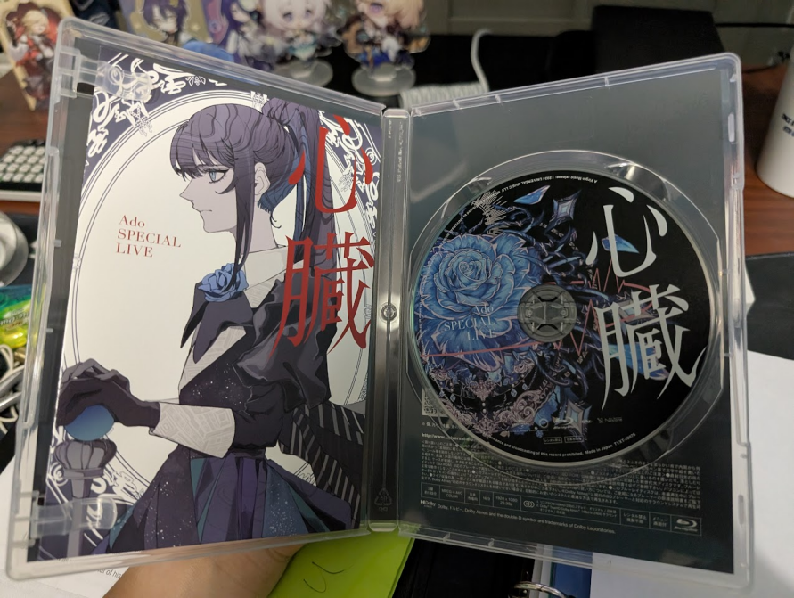
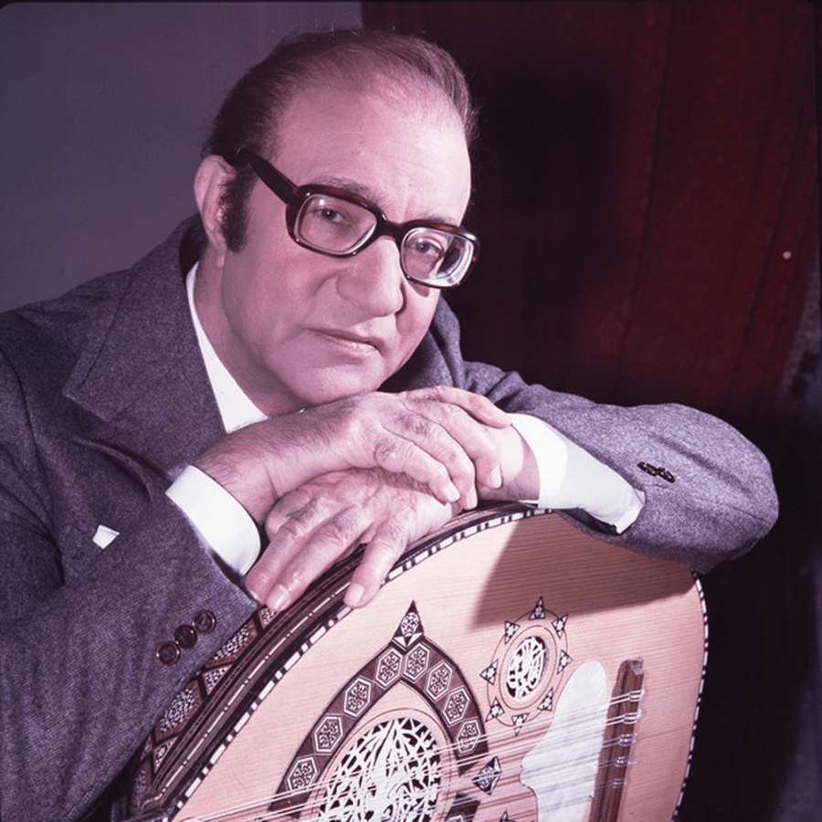
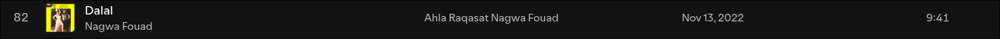
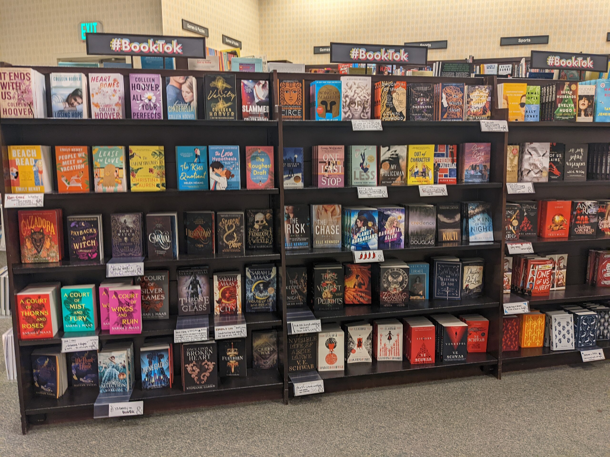

I'm a big proponent of physical media, especially when it comes to the music world. I think that buying something directly is the best way to support your favorite artists, rather than streaming it on a service like Spotify or Apple Music and them only receiving a cut of the profits. To this end I've bought digitally basically all the music I listen to, with the only exceptions being very obscure albums that I can't buy anymore in my region. This is one of the main pillars of what I feel it means to be a moral consumer: to own what you use. Nothing more, nothing less, just a paying customer.

This past month I decided to purchase Ado's Shinzou live Blu-ray. You can probably tell by the rest of the site and blog content that I'm a huge fan of hers, and I've always gone to her concerts and bought merchandise whenever I could, in addition to of course buying the albums. I got it from the official Ado Music Shop and it arrived within about a month. *Great! Now I can finally see her from the comfort of my own home!* 

...I thought, foolishly. 

You see, Blu-ray discs have copy protection, but naturally since I actually bought the damn thing and didn't plan on ripping it I should be able to play it just fine, right? Oh, no, no. AACS copy protection blocked me playing the actual, commercially distributed disc! 

This already was a bit of a shitshow as I could only play the disk on my geriatric standalone Blu-ray Player at that point, and not my PC or anything. Pirates and all those "people" just click a few buttons and wait for the torrent to finish downloading before they just have the file on their computer. Bullshit... who's actually being punished here. 

So I decided to write this scathing piece on modern media consumption as a whole to vent my frustrations with the media industry as a whole for forcing this bullshit down our collective throats and tying everyone in society up into a web of "convenience" which is keeping them shackled in their terrible subscription-based hellhole which damages both consumer and artist rights. I HATE IT HERE AHHAHAHHSHHAHHASSH

### Who's REALLY losing
I am a high school student in the glorious (not so much anymore) United States of America. The conformist pressure here is like a fucking vice that clamps down on any and all individual thought and expression. Whenever I text someone new they say "ew green bubble" and/or question why I don't have Instagram/Snap/X/Xiaohongshu/TikTok/whatever the fuck preferred spyware this generation uses. To that I say: who the fuck cares, if you're willing to get fucked in the ass by the government and these megacorps selling your data and messages so that they can train language models to take your job, and track you so they can kill you if you do anything wrong, I say go ahead. But I draw the line at fucking over artists and  musicians. 

That's unfortunately what's occuring at the moment. The way music consumption occurs in the modern West revolves around streaming of content directly to a device. This sounds good since you don't need to hog your own storage space for your media, however the execution is utterly detrimental to the media industry. In an ideal world, you could buy an album or something online and then it's open for you to stream to your device, maybe encrypted so you can't just intercept the file while it's being streamed and share it everywhere. That's not what happens though! Instead, after making an account on this usually free service, or through paying monthly, you get access to every song ever released by anyone to this platform, in exchange for said artists potentially being paid an [absolutely tiny fraction](https://www.inverse.com/input/culture/musicians-are-still-getting-screwed-over-by-streaming-services) of the ad revenue/your subscription payments if you listen; Gary Numan referenced in the previously linked article made just around $50 from a song with over a million streams on Spotify.

Consider how many people listened to his song. Let's make a few assumptions first; let's say the average listener listens around 10 times, to account for the fact that many on these platforms only listen once and others on repeat. This napkin estimate gives 100,000 people who listened to his song on Spotify. Even if we assume that less than 1% of these listeners would have bought the record, that's still a thousand people buying the song. That's at least a couple thousand dollars, even with the majority cut the record company gets. As Numan states, "If you're really at the top, then you can earn pretty well from streaming... if you're not, you might as well forget it, it isn't even worth printing it out, printing out the statement." 

There's lots of talk on the internet about how "TikTok/Spotify democratized the music industry" but at the end of the day these small artists are usually getting fucked out of a vast, vast majority of their well-deserved income. Music discovery services existed long before both of those platforms, the only caveat was that these didn't just let most people listen to the thing an unlimited amount of times for free; you still had to buy the record if you wanted permanent access. Bandcamp links in bios can only do so much. 

But get this; you, the consumer, are also being cheated, groped and grossly violated by the streaming service you pay monthly, the DMCA, and censorship statutes. With the power of DRM, content just disappears from these streaming services if someone doesn't like it. Here's my experience with music by Mohammed Abdel Wahab, a revered Egypt composer during the Nasser period, whom I deeply admire. 

#### The case of Mohammed Abdel Wahab

For as much as I shit on streaming, you're basically forced to use it because lots of music just isn't available to purchase these days and is streaming only- that or it's not sold in your particular jurisdiction. This was the case with Mohammed Abdel Wahab's music. Two songs of his I really loved because of the lyrical subject matter and the general composition; El Watan El Akbar and El Geal El Saed, both of which are pan-Arabist in nature. Please do note that both of these songs are perfectly PG and have nothing jingoistic about them. 

Well one day I awoke to find that both of these songs were now gone from my playlist, but not in the sense that the songs were grayed out and no longer playable like how it usually happens. No: they were deliberately replaced with different songs by the platform to avoid suspicion. Don your tinfoil hats, my friends....

These are the songs that they were replaced with, respectively: 

How do I know they were replaced? Because the previous hotlinks to both songs just go here now. Literally the URL is the same and just got transferred to these songs. Why, you may ask?

I have a theory here. These songs both disappeared around the same time, for one, so it probably was something coordinated. His other songs that weren't ideological weren't touched either, leading to this possibility which I believe to be true; the song was taken down because it represented an ideology that is currently not something the western governments (including that of Sweden, where Spotify is based) want around. Instead of leaving blanks, they were replaced with similar songs so that there'd be plausible deniability if anyone asked questions.

This is just another example of how DRM leads to content being at the mercy of whatever platform it's on, and platforms do this kind of stunt all the time. Amazon for instance [remotely deleted the books Nineteen Eighty-Four and Animal Farm from a high schooler's Kindle](https://ncac.org/news/blog/high-school-student-sues-amazon-for-deleting-1984-from-kindle)... talk about censorship. Point is, we can't trust these platforms to have either the artist or our interests in mind. 

### The degeneration of creative expression
Skip this if you're easily offended.

The afforementioned shift to streaming services and social media as the primary way for people to discover new media has made said media drastically worse. Let me paint a picture for you:

Previously, when discovering something new, it could have been either by word of mouth, someone else writing a review of it, or whatever other method. These all paint the content through someone else's lens and with their own interpretations on what it means and its value. From this you can deduce whether or not you want to check it out. As it stands, this is not how it occurs on social media. From talking with my friends about new artists they find, one of the primary methods is through them *hearing the song as a background track/hearing about the book on TikTok or other short-form content.* Why is this a bad thing? Because it forces lots of the independent artists to make art that is 1. instantly appealing at first glance and 2. easily consumed. 

*(RANT! RANT! RANT!)*

*People scrolling these brain destroying factory platforms do not have the will to turn on their brains to what they're hearing. If it sounds good, it's good... have you seen what the fuck passes for "music" or "literature" on these platforms? I don't care how much you like smut or how much you like the "best friend's brother" archetype or whatever the FUCK "tropes" you think makes a novel good, the fundamental fact is that these are mass-produced to cater to the audience and have zero artistic substance whatsoever. There, I said it. Fucking cry about it. Colleen Hoover and Jenny Han or what have you just turn out slop so that teens can stay at home and scroll TikTok or fucking RedNote and get the simulated joys of going out into the world instead of actually talking to people. Yes, I've read "The Summer I Turned Pretty" and "It Ends With Us"... they both are absolute nothing burgers in every sense of the word.* 

*Whatever happened to crack fanfiction? People are too scared to go on AO3 for their degenerate content, so you have to get a YA novel with a cute illustrated cover so that you can appear civilized while reading the same shit but soulless and corporate and executed even worse? You have NEVER read something good in your life so you're attempting to portray yourself as more intellectually open than you are but secretly close yourself off from any and all criticism and actually intellectually stimulating content because your brain is mentally stuck in the third grade. Nice work.*

Anyway, it all sucks now. If you wanna argue then email me or something, I'm happy to give you a more logical explanation, but this is too fun.

### You own nothing
Let me take a moment to go back to the Mohammed Abdel Wahab case study I presented earlier. The whole reason that and the Kindle incident happened is because we today as consumers have no ownership rights over the media content we consume. If you're using these platforms, you have NO control over any of it and the decisions they make. Despite you paying real money for it (either your cold hard cash or your time), you are merely lended the right to temporarily use the content. It's not in perpetuity or anything. They can do whatever they want with your money.

So then, if paying isn't enough to own something, then what does that make piracy? Everyone wants a permanent right to use their favorite media, but there's no way to accomplish that easily save for pirating it. I ask you, dear reader; at that point, *why should the consumer even bother to pay for it?* There is no other option to consume the media in perpetuity. Even as a person with a functioning moral compass and who doesn't like piracy as a result, it's clear that the media landscape is utterly hostile to the simple proposition of owning content. What's even the point of engaging with the system?

### What we ought to do
You can pin the blame on DRM, but at its core corporate greed is the cause for a lot of these troubles. Therefore, if we want to go back to a dignified way of consuming media, we must vote with our wallets. I do not give my money or time to these platforms or these entities. I support my favorite content financially in exchange for ownership of a copy. It's a customer-seller relationship, one that is disappearing fast across the developed world. 

Of course, not many people are going to go and read this. I hope you do consider what I've said here, though. 
