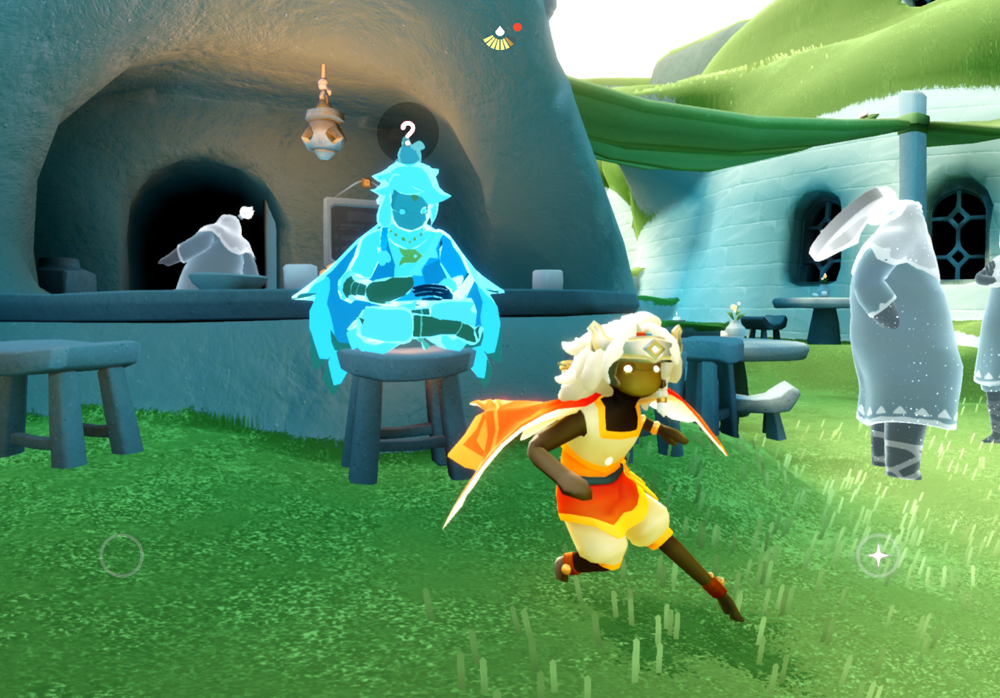

Recently I've started playing Sky: Children of the Light, and I have to say it's a pretty fun game, especially with friends. I was introduced by one particular friend of mine who's very close to me and who is a veteran from since the game first released, so it's been pretty smooth sailing. I will divide this review into two parts: one deals with what I think of the gameplay itself (the meat of the game) and one with all the community engagement and social features on here.

## Gameplay
If you go by any usual definition this game is pretty boring. Scratch that, it's very boring. Without diving into the details of the story, it's pretty slow paced and almost every character you meet has its own sidequest. The issue here lies in the fact that there are no words to be found in any of these, meaning that everything has to be orchestrated as if it's some sort of puppet show. Sure, there is a deeper plot, and I can understand why they made this creative decision, but to me this is somewhat of a dealbreaker; every game that I like to play does so through a detailed narrative, factions I can form opinions about, and greater themes. Without a greater literary component, there's not much for me to latch onto lore-wise. I suppose the characters are pretty cute though. 

Sky has a massive open world and plenty of different realms for you to discover and enjoy. I myself haven't found all of the the spirits yet. The task herein is actually quite difficult since you have basically no ingame map (one exists but is utterly useless since you can't access it on the move and is extraordinarily undetailed) and have to manually fly everywhere. I would say however that this in fact only contributes to the game experience since in other games you basically just fast forward through it all. It forces you to stay in the "here and now."

The flying mechanics are the hinge of the whole game and I have to say that after I turned on the "Invert Flight" setting in the control settings, it felt very natural and comfortable to fly around. There are two flying modes for when you are cruising and landing/navigating vertically, and each feels pretty decent. I don't appreciate however this weird autojump-y thing whenever you are going over small gaps. This is quite annoying especially in this one realm called the Valley of Triumph, and I wish there was some way to turn this off. Maybe there is and I'm just a dumbass, I dunno.

Now the big elephant in the room is the monetization model. You can definitely play Sky without paying, but it is VERY time consuming, and many things such as cosmetics are often locked behind a paywall. This is to be expected seeing as it is a free live-service game, one targetted at mobile devices too in fact. Needless to say, I find this very disagreeable, though that won't and hasn't stopped me from playing something. I did purchase this period's Season Pass for shits and giggles since I've been playing more recently and honestly it's not that bad of a deal. If you're familiar with something like a Hoyoverse game style battle pass, it's similar except it lasts twice as long and has way more exclusive content associated with it; from a F2P standpoint that last part is a bad thing, however if you're going to buy in anyway it's not too bad value.

To be frank, there's *lots* of bugs that seemingly have always been there and just never get fixed. There's tons of spots in various different maps where your character can just fall straight through the map, not to mention quite a few random crashes every now and then and general wonky behavior. Strangely, this didn't feel like it got too much in the way of gameplay. Overall it felt pretty well-refined apart from my prior disagreements with the autojumpiness. It's a polished and fun experience.

## Social features
This by far is what I feel to be the greatest selling point of this game, and why I would personally recommend you give it a try. The whole game is built around the vibrant worldwide community that has come to dwell in this world. In my first day of playing seriously, I met so many new people from places ranging from Peru to Spain to China and everywhere in between. Everyone was so welcoming and I'm happy to report that the Sky COTL community is probably one of the most genuine and friendly playerbases I've seen in basically any game. Why? The whole experience is built around playing with other players and interacting with the content that they make. Not only are there a ton of amazing shared spaces for you to explore but there are also things like... live music!?

*Did I read that right? Live music!??!?* That's right. Not only that but people are actually pretty good at playing these ingame instruments and you get to watch tons of live performances. It's pretty magical and I eventually want to learn how to play these things too... seems pretty fun.

Needless to say there's tons of fun to be had with the Sky community. It's genuinely so incredible and it's what keeps me logging on. Definitely give it a shot just for that.

## Conclusion
I would overall rate this game a 7/10. The gameplay itself I personally don't find to be the most fun but it might be perfect for someone else... if you like Animal Crossing or something you'd probably have a blast. Eden is pretty fun though. The social aspect on the other hand... that's the true selling point. Definitely give it a try if you have the time.

