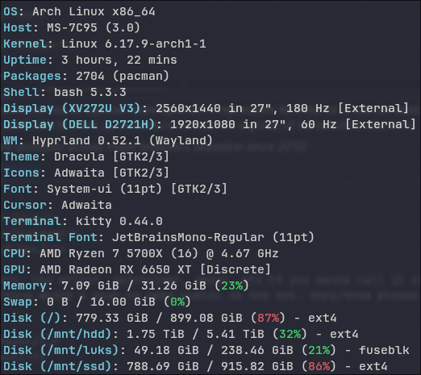
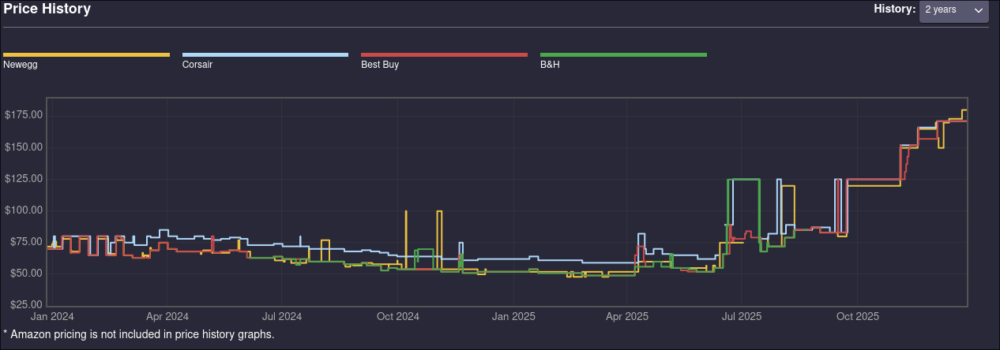
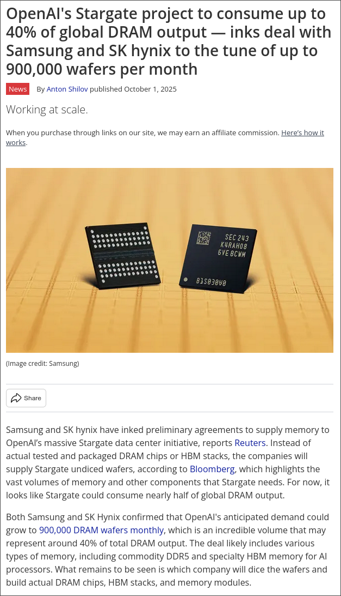

I built my computer around February of 2023, with some major upgrades having taken place since then, especially with a CPU upgrade in March 2024. This build had a budget of about ~$800 and I think that what I got was a pretty decent bit of computer for that amount of money. If one includes the upgrades and computing peripherals, I spent a total of around $1700 for my entire setup. 

Why do I say this? The parts I got at the time were a steal at the time, but why bring these figures up now? The fact of the matter is that the consumer electronics space has simply become far, far more expensive than it was previously, even with a timeframe as short as this. In fact, it is practically unaffordable to purchase a computer at a decent pricepoint if one considers new parts. There are a few main reasons behind this shift, however the biggest culprit is the surge in the AI bubble and the race to snatch as much computing power as possible by these AI companies. Case in point: the consumer tech market is dying, in favor of catering towards these large AI corporations and the corresponding market bubble.

The big headliner these days is RAM. RAM is necessary for any computer, and having more of it allows you to accomplish more and different tasks using said computer; I don't suppose I need to say this to whoever is reading this. As we all know, these days RAM is utterly unaffordable. Take the kit my computer uses for instance.

I got this kit of memory for US$77.99 from Newegg in February 2023, when 32 GB kits were still pretty expensive. Of course, they decreased in price over time, but they've been creeping back up...

From a low of about ~$50 this summer, the price of this kit has shot up more than 3x and it will now cost you around $180. What a world.

Why in the fuck is this happening? Well, the answer is just a few clicks away with modern internet; AI firms such as OpenAI have utterly gobbled up the RAM market with their ambitious new expansion plans. OpenAI is probably the main player in the LLM world at the moment, what with their products ChatGPT and Sora. As a high schooler, the impact they've had is pretty astounding, especially for students, and absolutely not in a good way whatsoever. If I may, I'll just list a few of the terrible complications of AI usage at my school in particular, as a first-hand observer...

- Obviously, people haven't been doing their assignments. It's become a terrible issue, and as someone who actually does bother to do the work without any LLM usage (I will never use that shit for school, even if it does cost me) it's terrifying how many people with such good grades don't know even the most basic information about the material we've been learning in the readings and in class.  And you wonder why you did so terrible on the final...
- Teachers too have been getting in on the AI fun. Last year, the AP Human Geography teachers at my school apparently set upon themselves to automate parts of their job with AI, in the worst way possible;  generating entire assignments, readings, and even major grade exams with ChatGPT. The signs were obvious, and the results were terrible; the school took action, but I fear that this is only the beginning of the end.
- People have been using LLMs, especially ChatGPT's 4o model, as a means of emotional companionship... I don't think I need to spell out what this means. It's predatory and terrible for people's mental health.

If you felt that was a bit of a headache, in conjunction with everything happening with regards to employment and governance... then wait 'til you hear about [OpenAI's new "Stargate" project](https://openai.com/index/announcing-the-stargate-project/)... and yes, it's as bad as it sounds. To quote from the linked post:

*The Stargate Project is a new company which intends to invest $500 billion over the next four years building new AI infrastructure for OpenAI in the United States. We will begin deploying $100     billion immediately. This infrastructure will secure American leadership in AI, create hundreds of thousands of American jobs, and generate massive economic benefit for the entire world. This project will not only support the re-industrialization of the United States but also provide a strategic capability to protect the national security of America and its allies.*
   
Let's put this blatant emotional engineering with the "national security of America" bit aside and consider the implications of this move. How much energy is this shit going to use? Where is the energy going to come from? Let's see what the AI bros in the [mainstream media](https://www.cnbc.com/2025/09/23/openai-first-data-center-in-500-billion-stargate-project-up-in-texas.html) have to say about it...

*OpenAI, Oracle and SoftBank, which is helping fund the project, announced on Tuesday five additional Stargate sites across Texas, New Mexico, Ohio and an additional unnamed site in the Midwest. That brings the size of the initiative to nearly 7 gigawatts and more than $400 billion of investment over the next three years, which includes an existing $300 billion agreement between OpenAI and Oracle.*

7 gigawatts. Let's put that into perspective. Kashiwazaki-Kariwa Nuclear Power Plant is the largest single-reactor nuclear power plant in the world if measuring by capacity, with capacity (when it was still running) sitting at around... 8 gigawatts, sans any factoring for inefficiencies in the distribution network and at the reactor end itself. So... yeah, that's kind of cooked. And what is this administration going to do to expand our great energy infrastructure? (which completely failed my great state of Texas about four years ago and led to several people dying of exposure because the grid wasn't weatherproofed in the slightest....)

*Sec. 3.  Immediate Review of All Agency Actions that Potentially Burden the Development of Domestic Energy Resources.  
    (a)  The heads of all agencies shall review all existing regulations, orders, guidance documents, policies, settlements, consent orders, and any other agency actions (collectively, agency actions) to identify those agency actions that impose an undue burden on the identification, development, or use of domestic energy resources — with particular attention to oil, natural gas, coal, hydropower, biofuels, critical mineral, and nuclear energy resources [...]
    Sec. 4.  Revocation of and Revisions to Certain Presidential and Regulatory Actions.  
    (a)  The following are revoked and any offices established therein are abolished: [...] 
    (xii)   Executive Order 14096 of April 21, 2023 (Revitalizing Our Nation’s Commitment to Environmental Justice for All). 
    (b)  All activities, programs, and operations associated with the American Climate Corps, including actions taken by any agency shall be terminated immediately.  Within one day of the date of this order, the Secretary of the Interior shall submit a letter to all parties to the “American Climate Corps Memorandum of Understanding” dated December 2023 to terminate the memorandum, and the head of each party to the memorandum shall agree to the termination in writing.  
    Sec. 6.  Prioritizing Accuracy in Environmental Analyses. [...] 
    (b) The Interagency Working Group on the Social Cost of Greenhouse Gases (IWG), which was established pursuant to Executive Order 13990, is hereby disbanded, and any guidance, instruction, recommendation, or document issued by the IWG is withdrawn [...]
    Sec. 7.  Terminating the Green New Deal.  
    (a)  All agencies shall immediately pause the disbursement of funds appropriated through the Inflation Reduction Act of 2022 (Public Law 117-169) or the Infrastructure Investment and Jobs Act (Public Law 117-58)
    ...among other things, read it here (https://www.whitehouse.gov/presidential-actions/2025/01/unleashing-american-energy/)*

Well shit. Thanks Trumpf, I hope you're happy that we're as a government buying into some fringe anti-renewable craze that stifles an emerging industry just to protect your industry connections. It's comforting to know that almost all the top decisionmakers in our government are so old that any bullshit they pull regarding the climate will have their crippling effects AFTER they die peacefully and rich of old age, and we as the younger generation will have to clean up and fight over the scraps. Good job.

Consider this love-triangle of fossil fuels, the US Government, and AI companies for a moment. Now turn your attention back to RAM, and it all makes sense...

Oh hell! No wonder the prices have gone up, they're buying up so much that eventually this one singular AI company could consume 40% OF GLOBAL OUTPUT. No wonder Micron disbanded Crucial to focus on AI, if they're buying up that much then I'd shift all my production to this fat market too! And this really is the situation that all of us (at least in the United States) are facing; a cabal of the leading AI entrepeneurs, the government, and other large corporations, cannibalizing our nation's resources, people, and capital, all to enrich themselves for what limited time they have left on this earth. It's cannibalism on a societal level, and while it might just be RAM chips today, soon it'll grow to food, housing, you name it... if we don't do anything about this oligarchization of the United States economy. Materialism and social media will catch up to all of us then, because we'll be too blinded by vanity and the pleasure trap to act. Don't act surprised when we end up in that dystopian society.

Goodnight.
