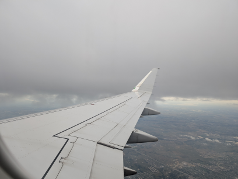
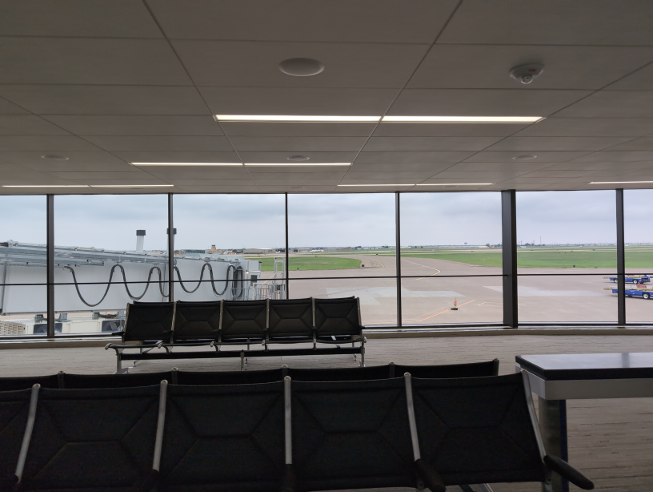
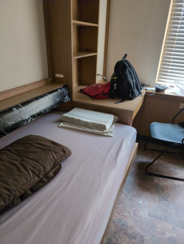
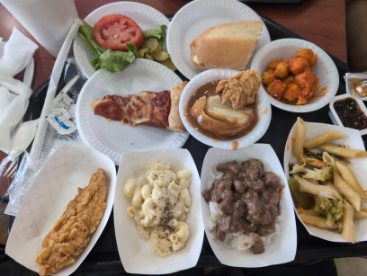
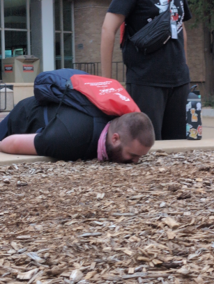

---

title: 2026 TTU ASCC and my thoughts on the All-State music
date: 2026-06-19
description: A brief intro to TTU ASCC and the TMEA All-State Choir music for 2026-27

---
I recently came home from my second year at Texas Tech All-State Choir Camp! All-State camps are always insanely useful to me since it's a great opportunity to get a head start on the music... auditions start just a few weeks after the school year starts. I always go to Tech because my choir director is one of the organizers and a lot of my friends go too. If I were to describe the atmosphere at TTU ASCC it'd be "Work hard, play harder." The rehearsals are all a real doozy and fast paced, and the activities in the evening are just as exhausting. If you're into that (I'm great with it as long as it's just a week a year...) then TTU could be a good option for camps! I've been to UNT and it's not as fun in my experience.

## Getting there

The first obstacle is, of course, getting there. Lubbock is probably one of the worse cities to drive to since no matter what direction you come from, you'll be going through straight desert for a good 6 hours. Thankfully, Lubbock has a solution in the form of Preston Smith International! Having drove last time... I'd say taking the flight is a far better option. It's just an hour flight from DFW and they've got a shuttle to take you straight to camp now. Plus, my counselor from last year was the one riding with us. heh. The flight was an Envoy Air flight aboard an Embraer E175. I've flown on the type quite a few times and it's about as good as you'll get on a regional flight of this length. It's so short there's no time for a drink service.

DFW airport is my home airport, so I've got a lot of experience navigating it. I would say it's up there in the better airports; I might be biased, but there is a decent amount of public transport to the airport (DART is actually decent these days) and the options for food and such aren't the absolute worst. I got a breakfast of loaded scrambled eggs, a maple sausage and egg croissant, hash brown bites, and a Coke from Portillo's. Decent joint.

My flight left at like 7:00 AM or some shit, so whenever I got to Lubbock it was, predictably, empty. My poor counselors looked so sleepy, but nonetheless we got going pretty quickly. 

## The camp itself

The dorms at Murdough Residence Hall are where you'll be staying at TTU ASCC.

I have some gripes with these dorms. One of the biggest issues IMO, though definitely just a university dorm thing rather than just something with Murdough, is that there's a single bathroom for the entire floor. This leads to an absolutely dire situation at the end of the day, since everyone showers at the same time (right after getting back from activities, just before lights out). The queues were up to 30 minutes for the 4 showers we could use. Doesn't help that everyone takes about an hour when they make it in.

A second major issue is how cold the rooms are (or, in some cases, how hot they are.) There are no ways to control the temperature in your room since there's no thermostat or anything, just a central vent. However, last year my dorm was insanely hot. I guess it's luck of the draw when it comes to that. I packed only a light blanket and so I was freezing each night.

Now, the res hall food is my main gripe. This isn't how it is during the year since I visited once in spring and it was pretty good, but during summer this is not it. It's basically school lunch that you might find at any public school in the state. They don't care if you grab more food than you are technically allowed to, but it's dire nonetheless. Here are some illustrative examples:

Alright, it's not THAT bad. It's passable especially if you add condiments. My mantra was slabber hot sauce and pico de gallo on everything and it'll taste alright. The main issue is the bubble guts you get afterward. As someone who eats good ol' Chinese food every day with a healthy dose of fiber....... it wasn't great.

The activities, as I mentioned were hella fun. What they were specifically I'm not gonna write here, I feel like that'd spoil the fun if you actually plan on going in the future.

## The music

The music this year is absolutely fire. Without a doubt, one of the best years for TMEA All-State in quite some time. It's challenging in a way that makes learning it rewarding, yet it's not so hard so as to be unapproachable. All the songs sound amazing! I love Sydney Guillaume and the fact TMEA selected my FAVORITE song of his (Plakatap) just makes me so happy. I'll comment on the ones I have stuff to say about. Happens to only be the mixed rep. For a full playlist of all the music, here: [2027 TX All-State 5A-6A Choir Audition Music - YouTube](https://youtube.com/playlist?list=PLPdRfm9C_79KO7q1bKZlf_wJTvQ97qB1w&si=1hieEiS0RWNsTGIs)

### Hiob; Fanny Hensel (Mendelssohn)
<iframe width="560" height="315" src="https://www.youtube-nocookie.com/embed/qBueuxEqDgM?si=TOfiLyIm1isFF4Vv" title="YouTube video player" frameborder="0" allow="accelerometer; autoplay; clipboard-write; encrypted-media; gyroscope; picture-in-picture; web-share" referrerpolicy="strict-origin-when-cross-origin" allowfullscreen></iframe>

The first thing I have to say is that this is a bitch to sing, but in a sorta good way? The entrances come out of nowhere and the intervals are a doozy. You have to find your pitch out of basically thin air for half of these entrances. That being said, it doesn't make this song at all irritating to sing. On the contrary; I find this to keep you locked in because once you learn it it's not hard... you just need to keep your focus, and keep your focus you will. Physically counting is a must for this thing.

I always love singing classical music, and Fanny Hensel is one of those early Romantic yet more classical-sounding composers that made just exhilirating music. I can hear the subject matter in the composition (the Book of Job). I really want to make the Mixed Choir and this piece is one of my reasons. The first movement especially is just so fun to sing. Can't wait to hear it with full orchestration, here's hoping I get to that point.

### Hold to God's Unchanging Hand (Hall; arr. Thompson)
<iframe width="560" height="315" src="https://www.youtube-nocookie.com/embed/ijQ70KoRgiM?si=gjLCShqForq1OW_M&amp;start=97" title="YouTube video player" frameborder="0" allow="accelerometer; autoplay; clipboard-write; encrypted-media; gyroscope; picture-in-picture; web-share" referrerpolicy="strict-origin-when-cross-origin" allowfullscreen></iframe>

The one recording anywhere I could find of the exact arrangement is pretty bad (no shade) so here's the original James Hall arrangement. Sounds close enough.

Gospel music and spirituals are always my favorite to sing whenever they put it on the audition roster, and this one's no exception. I'm no Christian but you can really feel it in you whenever you do a wild run or you get to the apex and you're basically screaming out the most beautiful shit you've ever heard. It's the USA's first and basically only true homegrown music genre these days and it really deserves to be put on the pedestal that it deserves. This song's no different to the other spirituals they've had in past years; it's amazing fun to sing, all of it makes sense, and if you're a Christian you can definitely apply whatever your beliefs are to how you sing this. It's so jubilant, really just puts this message out there; "Build your hopes on things eternal."

Damn. Wish I was Christian singing this. Happy Juneteenth btw.

### I Dream a World, from A Vision Unfolding (Pederson)
<iframe width="560" height="315" src="https://www.youtube-nocookie.com/embed/nVhr3HpDXFQ?si=l4C19IaBkTw61emf&amp;start=97" title="YouTube video player" frameborder="0" allow="accelerometer; autoplay; clipboard-write; encrypted-media; gyroscope; picture-in-picture; web-share" referrerpolicy="strict-origin-when-cross-origin" allowfullscreen></iframe>

(Skip to 13:45 for just I Dream a World; but listen to the whole thing if you have the time!)

This is my absolute favorite for this year. Not just because of the song itself, but because of the rest of A Vision Unfolding that unfortunately we won't be performing, at least to my knowledge. A Vision Unfolding is a five-movement work by Kyle Pederson (if it wasn't clear) and it deals with the issue of social justice. To do this, Kyle Pederson has put together some of the most rousing choral music you'll find written by a modern composer. The text includes one of my favorite Walt Whitman poems (Beat! Drums!) and, in I Dream a World's case in particular, the poem of the same name by Langston Hughes. Combined with the work that Shanelle Gabriel and Pederson himself put into the text, and of course the composition... your heart just heals listening to it all!

I really wish there were actual recordings of this with the full orchestration. Currently the only ones that exist are just with the violin, trumpet, snare drum, and piano... at TMEA, maybe...? Then they won't have the full work, though. Sads.

This song is really easy to sing compared to the others. The main point to note is the musicality of it. This is a Langston Hughes poem, for gods sakes, so there's no limit on how expressive you can sing this shit. It's a playground for the voice! Amazing.

### Water Fountain (arr. Fulton)
<iframe width="560" height="315" src="https://www.youtube-nocookie.com/embed/gb0vGxjQy10?si=i8SnADXbnyoyikJa&amp;start=97" title="YouTube video player" frameborder="0" allow="accelerometer; autoplay; clipboard-write; encrypted-media; gyroscope; picture-in-picture; web-share" referrerpolicy="strict-origin-when-cross-origin" allowfullscreen></iframe>

This is the obligatory fun fun fun piece that the Vancouver Youth Choir sang, which I notice is basically a requirement these days for TMEA each year. Not that that's a bad thing, I love the Vancouver Youth Choir as much as anyone and this song is a banger. 

The text sorta doesn't make sense. I know the arranger's notes says its about drought politics and youthful protest... I don't get it. It's fun as hell though! Again, easy to sing but this time I don't see much room for dynamic variation and stuff. I imagine this isn't what they'll be primarily judging off of.

### Cedit, hyems (Betinis)
<iframe width="560" height="315" src="https://www.youtube.com/embed/cFzj_pHsVJU?si=DT-nkrKZN6vwry9B" title="YouTube video player" frameborder="0" allow="accelerometer; autoplay; clipboard-write; encrypted-media; gyroscope; picture-in-picture; web-share" referrerpolicy="strict-origin-when-cross-origin" allowfullscreen></iframe>

"Oh fuck." is what I thought when we did the first listen of this. This is by far (it's not even close) the hardest song this year. Firstly, the time signature changes like 5 times a page (that's not an exaggeration), weird ass rhythms on top of that, the intervals are hard to make and the entrances are too, and overall it's just insanely difficult to learn, at least for me.

That being said, it is a nice sounding number in the same way that Butterfly Lullaby was a good sounding song last year. There's some music theory shit that I'm not equipped to comment on, but I certainly can sense its presence. It sounds like a good song. A bitch to sing, though.

 