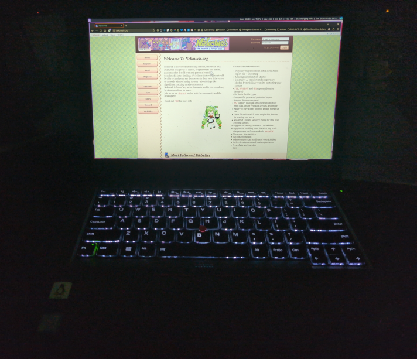
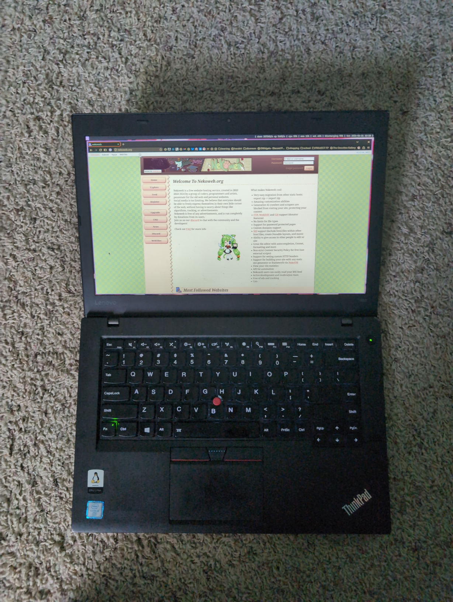
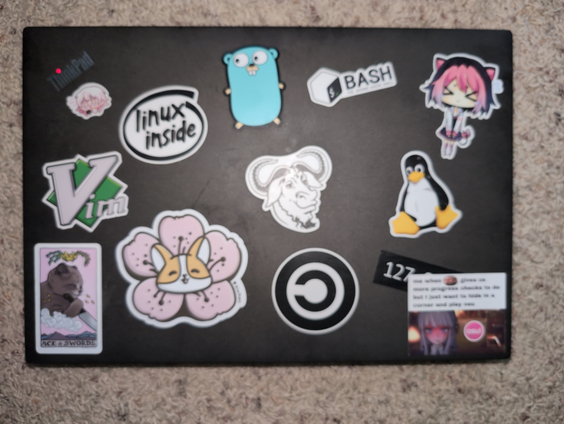
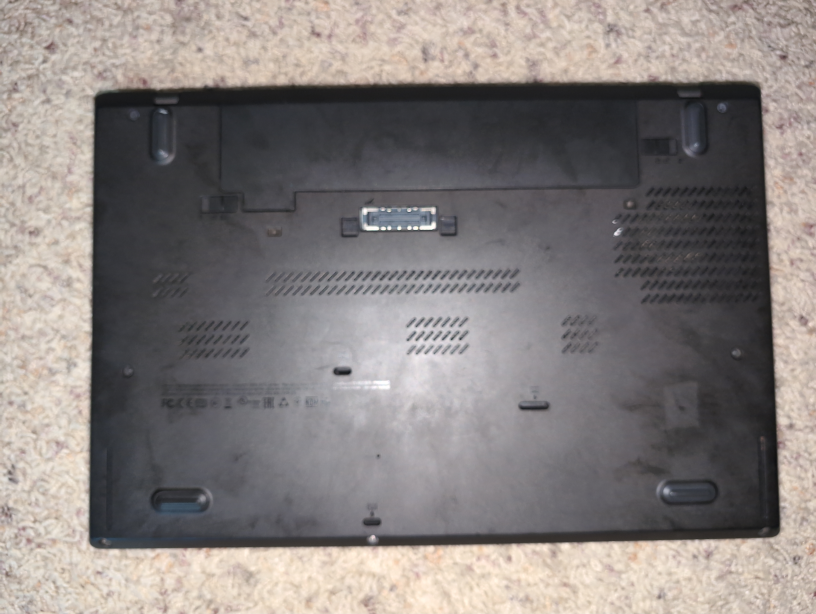
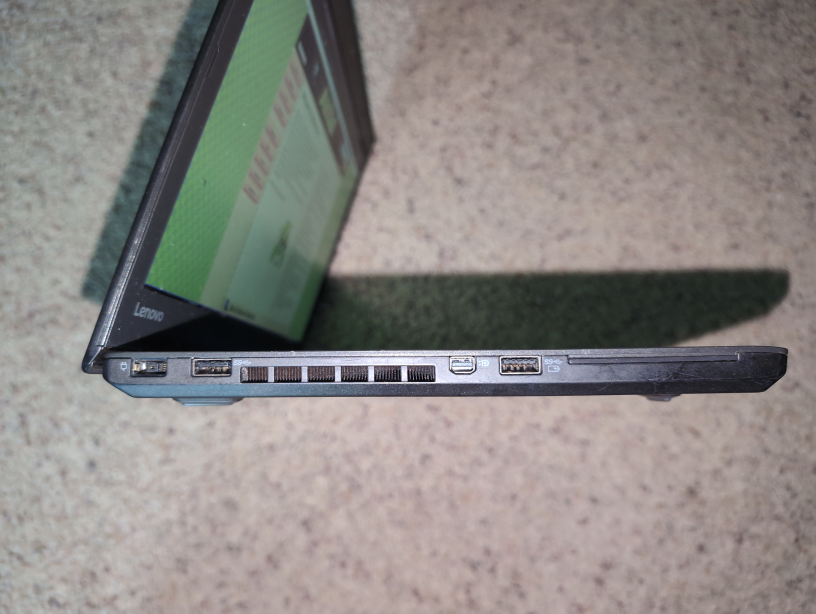
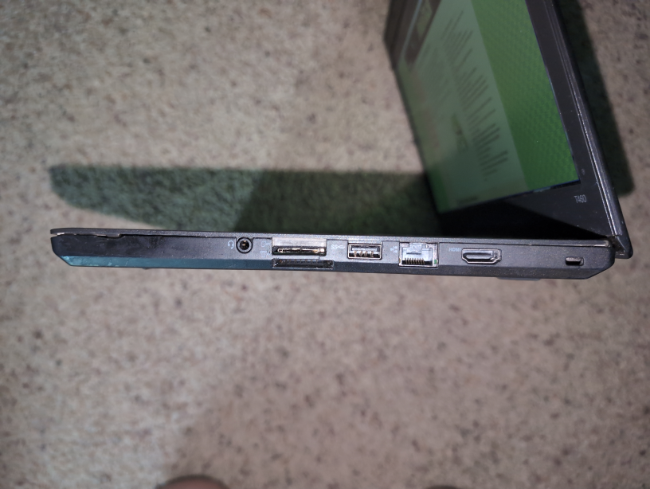

So recently I've finally bought a new laptop, a Thinkpad P14s. It's absolutely amazing and more than makes up for the austerity I had to go through in order to get the thing. Previously, I used the same Thinkpad T460 for about ten-ish years all the way from my first years of elementary school up to today. Somehow it's survived in decent shape and it's seen tons of upgrades too! Needless to say, parting with this laptop is gonna be difficult.

Here's the thing. I don't have much space in my room, and frankly I don't have much use for keeping this laptop; I already have a full purpose-built server and NAS, and I also have a VPS, so there's no need for a laptop server. Additionally, the stuff that I do day-to-day's gotten more and more heavy ie. CAD and FEA, so I can't exactly run it on this laptop. It's also heavy in comparison to my new Thinkpad, even if they're around the same dimensions, so it's not a good backup machine. Therefore, I'll be selling it.

The issue I have personally with making it open for anyone to buy is that it's too sentimental to me. It has a bunch of stickers on it that I don't want to peel off to make the listing more "saleworthy" and to be honest, I want to vet whoever gets this machine. I'd rather have a fellow nekowebber get to enjoy the computer! Therefore, this is the only place I'll be telling people about it publicly for now. (obviously, the transaction's gonna be done on eBay because buyer protection and all the logistics etc. Of course, if no one's interested after a while, I'll set up a regular listing somewhere else.)

## Details for the interested...
As I mentioned earlier, this transaction is *NOT* happening on here. If you're actually interested in buying the computer, dm me on one of the contact options on the site index and I'll discuss with you more details + answer any questions, and if you do end up wanting to buy it, I'll set up an eBay listing for you or a PayPal Goods & Services invoice and you'll do the transaction on there so you can return it, get a refund, wtv all that.

That all out of the way, I'm planning to sell this machine for $75 USD shipped (from Texas, USA). To me that seems like a good enough discount compared to other similar listings that I see which are hovering ~$100 USD for a worse spec and the TN panel. I'm flexible with this though and again, if you're interested please do discuss all that with me. Mainly I'm just interested in having someone else be able to use it and get some enjoyment out of it.

### Machine specs + included stuff

- Processor: Intel Core i5-6300U (2c, 4t) [info](https://www.intel.com/content/www/us/en/products/sku/88190/intel-core-i56300u-processor-3m-cache-up-to-3-00-ghz/specifications.html)
- Graphics: Integrated Intel HD Graphics 520
- Memory: 2x8GB (16GB) DDR3L @1600mhz if I recall correctly
- Storage: 1TB Crucial MX500 SATA SSD,  drive health data in images below
- Display: 14" 1080p matte IPS display (AU Optronics B140HAN01.3), upgraded from a 768p TN panel
- Battery: 1 internal 24whr (health 85%), 1 external hotswappable 24whr (health 92%)
- Additional notes: came with a Windows 10 Pro license, it's tied to the BIOS I think so it might stlil work. Don't quote me on that though, I can't test that. Minor wear and tear + three of the bottom cover screws  are missing, doesn't impact use.

Included stuff:
- 90 watt Lenovo OEM charger
- Stickers ig (they're already on and I don't wanna be the one to peel them off)
- A nice handwritten note

### Gallery

Laptop opened

Top cover

Bottom cover

Left side I/O

Right side I/O

SMART data for the SSD.

