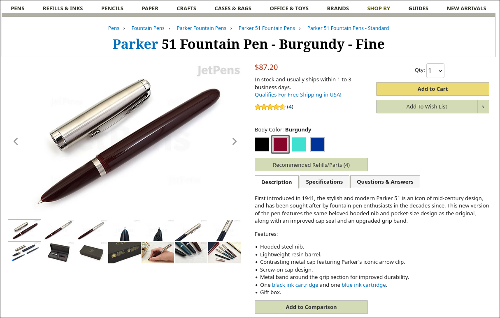

I've been using a Wing Sung 601 as a daily pen for school and notetaking for about 3 months now.  I decided that I'm going to go and write a more extensive review since the ones I've seen are coming from a place of, "fountain pen enthusiast" first rather than being a student first. Doodlebud for instance put out a great review, but he's primarily approaching the pen from that perspective with his main talking points about it specifically being a pen for school being the cap, ink capacity, and the price; these are important but not the sole bailiwick for the Wing Sung 601. I am a stationery enthusiast, but I'm one on a budget and I'm using my pens as a means to an end (writing good notes) in a way that makes me happy, rather than an end in itself.

That all being said, let's begin.

#  The pen I have
My particular Wing Sung 601 is a clear demonstrator with an EF nib that I bought from 365Days Stationery on AliExpress. 

My experience with this particular seller has been pretty good in the past. They have a good reputation and their products ship pretty fast by AliExpress standards; it took less than a week for this pen to arrive, which is a miracle compared to some other stuff on AliExpress. They offer all the colorways offered by Wing Sung and I'd recommend them if you want to buy this pen yourself. Just remember it's "365Days," and not "365 Days."

## Build
Sometimes people have quality concerns about pens from Chinese manufacturers; that's definitely the case for those no-name pens you might find on say Amazon or AliExpress with a million buzzwords in the product listing and no brand name on either the listing or the pen itself. Those come with random generic nibs or those god-awful "Genius Iridium" branded nibs that have the most horrendous alignment and all that out of the box. That being said, major well-established Chinese manufacturers like Wing Sung/Hero, Hongdian, Jinhao, Kaigelu etc, and new but well-regarded manufacturers like Admok or whatever are generally quite good in this regard nowadays. Any problems you have I find can generally be fixed with some slight nib tuning.

The Wing Sung 601 is made of a plastic material that's robust enough and feels solid to write with; it doesn't feel cheap to me at all. The cap and filler button are both metal. 

Doodlebud mentioned in his review that the cap closing mechanism feels scratchy compared to the original Parker 51; having used one before, I personally think that the difference isn't all that relevant to daily usage. The hooded nib means that you don't need to cap and uncap much since it won't dry out quickly.

One concern that some may have (me included) is whether the pen will feel sticky after writing with sweaty hands. I have hyperhidrosis which causes all sorts of issues for me, including the development of a sticky residue of sweat and like fabric bits from wiping my hands on my pants on pens made of certain materials. This is a massive issue with my TWSBI Diamond 580 ALR. While this can be easily fixed in a few seconds with just a paper towel and warm water, nonetheless it bugs me, and I'm sad to say the 601 also does this to an extent. While it's not as bad as the TWSBI, it's still uncomfortable after a day of writing.

## Writing experience
The Wing Sung 601 is a replica of the Parker 51 and therefore has its iconic hooded nib. 

*Gee... wonder where Wing Sung got the idea for this design...*

Let's keep our expectations grounded; this nib is really quite rigid and you won't get any line variation, nor will it be the most orgasmic buttery writing experience you will ever have. This is a pen for daily writing and not a masterpiece. That being said, there is a gold nib offered that you can upgrade to; I personally can't attest to how it writes. 

The fact that it's a hooded nib means you don't have to cap and uncap immediately after writing; it won't dry out quickly, so you can leave it uncapped for some minutes and it'll still write fine afterwards. It's super convenient for lectures since those lead to start-stop writing and you can just pick up your pen and start writing whenever you need to note something down.

I only have the extra fine so I can only speak in regards to that; my experience writing with it has been pretty good. It's a pretty wet writer IMO, but it'll perform well on any sort of paper, especially with a well behaved ink like Waterman Serenity Blue or what I have in here, Noodler's Heart of Darkness. The paper I use is Kokuyo Campus Sarasara and it writes wonderfully; on school copy paper it's decent as well. 

The nib offers a decent amount of feedback. For some people, this may be a great thing; others might not find it desirable. It really comes down to personal preference. For me, this is perfect.

This pen's on the smaller side. As someone with smol cute hands, this is perfect! Just note that if your hands are larger, you may have to adjust your grip, but I don't think it's too bad. I write a shitton by hand as I refuse to take any notes digitally and I'm in an extremely course-heavy schedule, in addition to having many extracurricular classes and activities that I likewise handwrite notes with; I've never had any issues with cramping or anything after long writing sessions. 

In my experience, a fill will last about a week to two weeks of writing; the ink capacity is great and with an extra fine nib it doesn't go through much ink. There are no hard starts since this cap seals extremely well; this slip cap seals better than some of my screw cap pens like the Admok M800 which is double the price. I've left this pen upright for days and it writes immediately every time.

# Using the pen at school
This pen's been my daily pen for school since I got it; I use just this pen alongside my highlighters and my pencil for math. I don't think I could imagine a better pen for high school than this; my Vanishing Point is obviously a better writer in general, but the clip, the relatively low ink capacity, and the fact it's approaching $200 means that it's absolutely terrifying to carry every day at school. A pen like this not only has the structural attributes that makes a pen good for school (high ink capacity, slip cap, hooded nib, durable) but also doesn't cost much and is pretty low key compared to other fountain pens (another benefit for hooded nibs). 

### Edge cases...

One thing that people are concerned with about bringing fountain pens to school is what'll happen if someone borrows it. My first immediate response to this is: bring a backup. In my experience, no matter what fountain pen you have or what nib it has, dumbasses at school will still ruin it. (even your friends). Bring protection:

However... that's not really an answer to the question. What WILL happen?

I decided to use some friends to run a quick experiment! Bear in mind these are all kids who got into a prestigious and selective research camp, so they'll be above median; nonetheless, this should be a decent window into how regular people respond to the Wing Sung 601. The results were as follows:

- 5 people attempted to write with it upside down. I thought they'd be able to hold it correctly; I can kind of see why you'd do that with a regular fountain pen, but there's literally no reason to hold this pen upside down.
- 7 more people who held it the right way pressed down as if it was a ballpoint. I suppose that will be your main concern with this pen (actually any fountain pen at that) but this one's robust enough to handle it without adverse effect. Not as if it's a malleable nib and most people aren't going to press down insanely hard unless they've literally never written with a pen and only write with pencils.
- 1 person recognized it as a fountain pen and asked if it was a Parker! 

So the performance is *better* than other fountain pens and it can withstand more abuse on that front. That being said, I would still say you should carry a backup Bic in your bag. I just wouldn't risk it no matter what pen it is. There's also the issue of whether they'll give it back or not, after all.

An issue I ran into with clear demonstrators, especially the TWSBI Diamond 580 ALR, was that using them at school carried the risk of them being misidentified as a vape pens. I personally think this is completely stupid, especially since my ink is always black for my school pens... what kind of vape juice would be black? That sounds terrible.

Nonetheless, I know this might concern some people. Thankfully, since you will actually be writing with this posted and it bears a more pen-looking facade, you probably won't be having that issue with the 601. There's also the thing that the 601 comes in colors that are not in fact clear demonstrators, unlike the 580 ALR. Any other color will look classy as hell and more like a Parker 51 + you can get them with ink windows; I just like demonstrators. 

## How I fill the 601 at school
I know this isn't specifically related to the 601 itself, but this is still important because the 601's filling mechanism is a pretty unique challenge for inking it at school. I fill my pens at school with ink vials that I store in an Altoids tin; as you all may know, ink vials are pretty wobbly if you try to feed a pen directly from it without a syringe or anything. Issue is, you can't bring syringes to school (well, mine at least) because it looks like drug paraphernalia, so you're forced into filling it straight from the vial.

The 601 uses a push button filling mechanism. It's really simple to use and reliable, but since ink vials are unstable, it can get pretty dicey. Not only that, but by its nature the filling mechanism fills the vial with bubbles; you also need to press a few times to get a full fill, so if you just press like you normally would, the vial becomes so inundated with bubbles that it's hard to get much ink inside after a point. The solution to this is pretty simple; what I do is I fill the ink vial only to about 75% whenever I'm topping it up. This mitigates any risk of it spilling over the sides. Then, whenever I'm filling, I do one press, wait a few seconds for the bubbles to dissipate, and then go in again. This lets me get a full reservoir when I refill from a vial.

## Performance on school paper
I talked earlier about this nib's performance on my paper and I said it performed admirably on school copy paper. I'll go into more detail on that here.

Now, there's many things that affect a nib's performance on bad paper. I think the main factors to consider are nib size and the ink you're using; I would say that the ink you fill it with generally is more important once you've gotten to an extra fine. If you're inking your pens with some crazy inks then it'll bleed and feather no matter what nib size you have if it's on school copy paper. As I stated earlier, I ink this one with Noodler's Heart of Darkness; it's really resistant to bleeding and feathering, making it one of the best in this regard. However, I'm aware that having such a powerful ink that's kinda difficult to clean + doesn't look interesting isn't appealing to some. Therefore, I've gone and tested this pen with a greater variety of inks on school paper.

Generally, the verdict is: quite good. I've written with Waterman Serenity Blue, Waterman Intense Black, and then for fun I went and inked it with Diamine Writer's Blood. Serenity Blue was obviously amazing, and the other two performed well too. If you're writing in a conventional ink in a conventional school-acceptable color, you'll be fine with this pen.

It does feel a bit scratchy if writing with the paper directly on the desk. I think my school uses Amazon Basics copy paper, which from my experience is sort of middle of the road when it comes to copy paper; it may fare worse in your case. It'll take some testing if you choose to get this pen yourself. However... you're writing with a fountain pen at school. That's the kind of tradeoff you'll be making, usually.

## Other thoughts
- An issue that I've faced myself using fountain pens for school is that sometimes your pens will be upside down for an extended period and they might leak ink. This all comes down to how you choose to store your pens; the way I do it now is I have a pencil case that's big enough to fit snugly in my water bottle pocket, meaning it will never be upside down. However, I still decided to test what it was like if it was nib-down for a period. I walked to my local library, got Chipotle, browsed a bit and walked back home (~50 minutes or so?) with it stored loose in my backpack alongside my other stuff; there was nothing amiss and no ink had leaked out. I still wouldn't do that though, it's a bad habit.
- Many people like to eat snacks at school, myself included. I love my pens too much to touch them after eating a bag of chips without washing first, but I went and slathered my Taki dust laden hands all over the pen, left it for a bit, and then wiped it off with warm water and a paper towel. There was no lingering oilyness nor was there any smell that was left over. Still; please don't do that to your pens.

# My verdict
I'd say this is a solid pen. It's served me well over the past few months I've had it and it's a good writer that's inexpensive and has design characteristics that make it great for school. If you're interested, I think this is a nice buy.